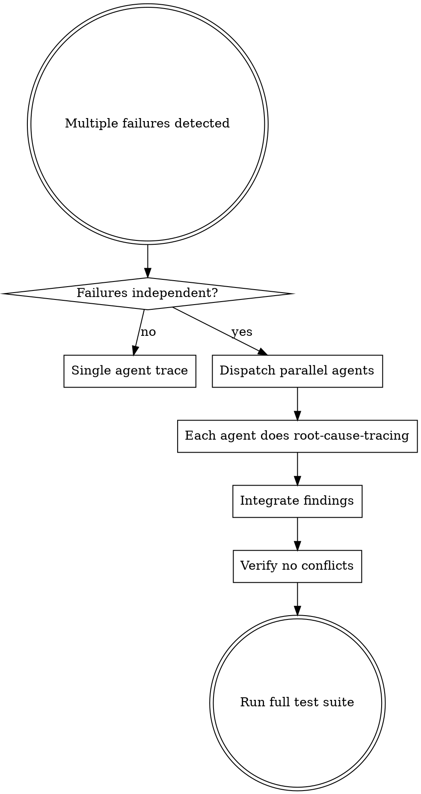

# MCP SkillSet Orchestration Workflows

Nuanced workflows combining multiple skills from `mcp-skillset` for sophisticated problem-solving.

## Workflow 1: Parallel Debugging Orchestration

**Combines:** `dispatching-parallel-agents` + `root-cause-tracing` + `systematic-debugging`

### When to Use



### Pattern Implementation

```typescript
// Phase 1: Classify failures
const failures = [
  { file: 'auth.test.ts', type: 'timing', domain: 'authentication' },
  { file: 'api.test.ts', type: 'data', domain: 'api-layer' },
  { file: 'db.test.ts', type: 'state', domain: 'persistence' }
];

// Phase 2: Check independence
const independent = failures.every((f, i) =>
  failures.every((other, j) => i === j || f.domain !== other.domain)
);

// Phase 3: Dispatch parallel agents with root-cause instructions
if (independent) {
  for (const failure of failures) {
    Task(`
      Investigate ${failure.file} using root-cause-tracing methodology:

      1. OBSERVE: What error appears?
      2. TRACE: Follow call stack backward to origin
      3. IDENTIFY: Find original trigger (not symptom)
      4. FIX: Address root cause at source
      5. DEFEND: Add validation at each layer

      Do NOT fix where error appears. Trace to source.
      Return: Root cause, fix applied, defense layers added.
    `);
  }
}
```

### Key Principles

1. **Independence Check First**: Only parallelize truly independent domains
2. **Each Agent Uses Root-Cause**: No symptom fixes, trace to origin
3. **Integration Review**: Check for conflicts before merging
4. **Defense-in-Depth**: Each agent adds layer validation

---

## Workflow 2: TDD-Driven Root Cause Resolution

**Combines:** `test-driven-development` + `root-cause-tracing` + `verification-before-completion`

### When to Use

- Bug reported in production
- Regression detected in CI
- Intermittent test failures

### The TDD Root Cause Cycle

```
┌─────────────────────────────────────────────────────────────┐
│  1. REPRODUCE: Write failing test capturing bug behavior    │
│     ↓                                                       │
│  2. TRACE: Use root-cause-tracing to find origin            │
│     ↓                                                       │
│  3. FIX: Make minimal change at root cause                  │
│     ↓                                                       │
│  4. VERIFY: Test now passes (Green)                         │
│     ↓                                                       │
│  5. REFACTOR: Add defense-in-depth (keep tests green)       │
│     ↓                                                       │
│  6. REGRESSION: Ensure no other tests broke                 │
└─────────────────────────────────────────────────────────────┘
```

### Implementation

```python
# Step 1: Reproduce with failing test (Red)
def test_should_not_create_duplicate_sessions_when_race_condition():
    """
    Bug: Two concurrent requests create duplicate sessions
    Root cause: Unknown - need to trace
    """
    # Arrange
    user = create_test_user()

    # Act: Simulate concurrent session creation
    with concurrent.futures.ThreadPoolExecutor(max_workers=2) as executor:
        futures = [executor.submit(create_session, user) for _ in range(2)]
        sessions = [f.result() for f in futures]

    # Assert: Should only create one session
    assert len(set(s.id for s in sessions)) == 1  # FAILS - creates 2

# Step 2: Trace to root cause
# Symptom: Two sessions created
#   ← create_session() called twice
#   ← no mutex/lock in session creation
#   ← ROOT CAUSE: Missing concurrency control in SessionManager.create()

# Step 3: Fix at source
class SessionManager:
    _lock = threading.Lock()

    def create(self, user):
        with self._lock:  # FIX: Add concurrency control
            existing = self.get_by_user(user)
            if existing:
                return existing
            return self._create_new_session(user)

# Step 4: Verify test passes (Green)
# Step 5: Add defense-in-depth (unique constraint on DB)
# Step 6: Run full test suite
```

### Critical Rules

1. **Test the Bug First**: Never fix without reproduction test
2. **Trace Before Fix**: Don't guess - follow call chain to origin
3. **Fix at Source**: Address root cause, not where error appears
4. **Verify Thoroughly**: Run full suite, not just new test

---

## Workflow 3: Multi-Agent Feature Development

**Combines:** `dispatching-parallel-agents` + `test-driven-development` + `writing-plans`

### When to Use

- Large feature spanning multiple domains
- Independent components with clear interfaces
- Team velocity optimization

### Orchestration Pattern

```yaml
feature: User Authentication with OAuth + MFA
domains:
  - auth-core: "Core authentication logic"
  - oauth-providers: "OAuth integration (Google, GitHub)"
  - mfa-implementation: "TOTP/SMS verification"
  - ui-components: "Login/signup forms"

orchestration:
  phase_1_design:
    action: "Write contracts and interfaces"
    agents: 1 (architect)
    output: "Interface definitions, API contracts"

  phase_2_parallel_tdd:
    action: "TDD implementation per domain"
    agents: 4 (parallel)
    each_agent:
      - "Write failing tests for domain"
      - "Implement to pass tests"
      - "Refactor with tests green"
    output: "Tested implementations"

  phase_3_integration:
    action: "Integration testing"
    agents: 1 (coordinator)
    tasks:
      - "Wire components together"
      - "Integration tests across boundaries"
      - "E2E workflow tests"
    output: "Working integrated feature"
```

### Agent Task Templates

**Auth Core Agent:**
```markdown
Implement authentication core using TDD:

Domain: auth-core
Interface: AuthService { authenticate(credentials), validate(token), refresh(token) }

1. Write tests for authenticate() - happy path, invalid creds, locked account
2. Implement authenticate() to pass tests
3. Write tests for validate() - valid token, expired, revoked
4. Implement validate() to pass tests
5. Write tests for refresh() - valid refresh, expired, used
6. Implement refresh() to pass tests

Do NOT implement OAuth or MFA - those are separate domains.
Return: Test file + implementation + coverage report
```

---

## Workflow 4: Emergency Debug Escalation

**Combines:** `root-cause-tracing` + `systematic-debugging` + `verification-before-completion`

### Escalation Levels

```
LEVEL 1: Single Failure
├── Apply root-cause-tracing directly
├── Fix at source
└── Verify with existing tests

LEVEL 2: Multiple Related Failures
├── Apply systematic-debugging Phase 1 (investigation)
├── Use root-cause-tracing per failure
├── Look for common root cause
├── Fix shared source if found
└── Verify all failures resolved

LEVEL 3: System-Wide Issues
├── Dispatch parallel agents per subsystem
├── Each agent: systematic-debugging + root-cause-tracing
├── Coordinator: Pattern detection across findings
├── Fix: Address systemic issues
└── Verify: Full regression suite

LEVEL 4: Production Emergency
├── STABILIZE: Immediate mitigation (rollback if needed)
├── ISOLATE: Identify affected components
├── TRACE: Root-cause-tracing on isolated problem
├── FIX: Minimal targeted fix at source
├── VERIFY: Extensive testing before redeploy
└── POSTMORTEM: Document and prevent recurrence
```

---

## Workflow 5: Continuous Quality Pipeline

**Combines:** `test-driven-development` + `verification-before-completion` + `condition-based-waiting`

### Quality Gates

```yaml
pre_commit:
  - lint: "Code style and formatting"
  - type_check: "Static type analysis"
  - unit_tests: "Fast unit tests (<30s)"

pre_merge:
  - integration_tests: "Cross-component tests"
  - coverage_check: "Minimum 80% coverage"
  - security_scan: "Vulnerability detection"

post_merge:
  - e2e_tests: "Full user journey tests"
  - performance_tests: "Latency and throughput"
  - smoke_tests: "Production health checks"

deployment_verification:
  skill: verification-before-completion
  checks:
    - "All tests passing"
    - "No regressions"
    - "Performance within SLA"
    - "Rollback plan ready"
```

---

## Skill Combination Matrix

| Problem Type | Primary Skill | Supporting Skills | Workflow |
|-------------|---------------|-------------------|----------|
| Single bug | root-cause-tracing | systematic-debugging | Direct trace |
| Multiple independent bugs | dispatching-parallel-agents | root-cause-tracing | Parallel trace |
| New feature | test-driven-development | writing-plans | TDD cycle |
| Large feature | dispatching-parallel-agents | TDD, writing-plans | Multi-agent TDD |
| Regression | test-driven-development | root-cause-tracing | Reproduce-trace-fix |
| Production issue | verification-before-completion | all above | Emergency escalation |

---

## Quick Reference Commands

```bash
# Search for debugging workflows
mcp-skillset search "debugging root cause" --search-mode semantic_focused

# Get skill details
mcp-skillset info "obra/superpowers/skills/dispatching-parallel-agents"

# Enrich prompt with relevant skills
mcp-skillset enrich "Fix race condition in session manager" --max-skills 3

# Build custom skill
mcp-skillset build-skill --name "Custom Workflow" --domain "development" --template base
```

---

## Integration with mcp-skillset CLI

### Discovery Phase
```bash
# Recommend skills for current project
mcp-skillset recommend --search-mode graph_focused

# Search by problem pattern
mcp-skillset search "testing TDD verification" --limit 10

# Get detailed skill info
mcp-skillset show "bobmatnyc/claude-mpm-skills/universal/testing/test-driven-development"
```

### Execution Phase
```bash
# Enrich prompt with skill context
mcp-skillset enrich "Implement feature X with TDD" --detailed --max-skills 5

# Generate skill demos
mcp-skillset demo "test-driven-development"
```

---

## Workflow 6: Context Engineering Orchestration

**Combines:** `dispatching-parallel-agents` + `writing-plans` + memory systems + retrieval

### When to Use

- Multi-agent systems where context windows are saturating
- Tasks requiring information from multiple sources (docs, code, APIs, memory)
- Long-running sessions approaching context limits
- Sub-agent architectures needing just-in-time context

### The Context Engineering Cycle

```
┌──────────────────────────────────────────────────────────────┐
│  1. AUDIT: Measure current context budget usage              │
│     ↓                                                        │
│  2. SEGMENT: Classify context by volatility and relevance    │
│     ↓                                                        │
│  3. STRATIFY: Assign to persistence layers                   │
│     ↓                                                        │
│  4. RETRIEVE: Just-in-time context for each sub-agent        │
│     ↓                                                        │
│  5. COMPACT: Structured note-taking to reduce context rot    │
│     ↓                                                        │
│  6. VALIDATE: Verify agent outputs against full context      │
└──────────────────────────────────────────────────────────────┘
```

### Context Stratification Model

```yaml
layers:
  persistent:
    store: "memory files, CLAUDE.md, project docs"
    volatility: low
    retrieval: "loaded at session start"
    examples: "user preferences, architecture decisions, project goals"

  session:
    store: "plans, task lists, conversation state"
    volatility: medium
    retrieval: "maintained in active context"
    examples: "current implementation plan, in-progress task tracking"

  ephemeral:
    store: "tool results, file contents, search results"
    volatility: high
    retrieval: "just-in-time per sub-agent"
    examples: "grep results, file reads, API responses"

  derived:
    store: "sub-agent summaries, compacted findings"
    volatility: medium
    retrieval: "promoted from ephemeral after validation"
    examples: "research findings, codebase analysis results"
```

### Sub-Agent Context Injection Pattern

```python
# Anti-pattern: Dump everything into every agent
agent_prompt = f"{full_codebase}\n{all_docs}\n{all_history}\nNow fix bug X"

# Pattern: Just-in-time context per agent's domain
def build_agent_context(agent_domain, task):
    context = {
        "task": task.description,
        "constraints": task.acceptance_criteria,
        "domain_files": retrieve_relevant_files(agent_domain, task),
        "interfaces": get_boundary_contracts(agent_domain),
        "recent_decisions": get_decisions_affecting(agent_domain),
    }
    # Budget check: stay under 40% of agent's context window
    assert estimate_tokens(context) < agent.max_tokens * 0.4
    return context

# Dispatch with scoped context
for domain in independent_domains:
    ctx = build_agent_context(domain, task)
    Agent(f"""
        Context: {ctx}
        Task: {task.description}
        Scope: Only {domain.name} — do not modify other domains.
        Return: Summary of changes + key decisions made.
    """)
```

### Compaction Strategy

```yaml
triggers:
  - context_usage > 60%: "Compact tool results to summaries"
  - context_usage > 80%: "Archive completed sub-tasks, keep only decisions"
  - context_usage > 90%: "Emergency: persist to memory, start fresh sub-agent"

compaction_rules:
  - "Replace raw file contents with 'File X: [summary of relevant sections]'"
  - "Replace search results with 'Found N matches: [key findings]'"
  - "Keep all user decisions and constraints verbatim"
  - "Keep all interface contracts and type signatures"
  - "Discard intermediate reasoning, keep conclusions"
```

### Key Principles

1. **Budget-Aware**: Every context injection has a token budget
2. **Scope Minimization**: Each agent gets only what it needs
3. **Structured Notes**: Compacted summaries preserve signal, discard noise
4. **Promotion Path**: Ephemeral findings get promoted to persistent memory when validated
5. **No Context Rot**: Stale information is worse than missing information

---

## Workflow 7: Safe Migration & Large-Scale Refactor Pipeline

**Combines:** `test-driven-development` + `verification-before-completion` + `dispatching-parallel-agents` + `writing-plans`

### When to Use

- Renaming across entire codebase
- Framework/library version upgrades
- Architecture migrations (monolith → services, ORM swap, etc.)
- API contract changes affecting multiple consumers

### Migration Pipeline

```
┌──────────────────────────────────────────────────────────────┐
│  Phase 0: SNAPSHOT                                           │
│  ├── Full test suite passes (baseline)                       │
│  ├── Record coverage metrics                                 │
│  └── Create migration branch                                 │
│                                                              │
│  Phase 1: SCAFFOLD                                           │
│  ├── Write migration plan with explicit scope                │
│  ├── Identify all affected files (grep/ast analysis)         │
│  ├── Classify changes: mechanical vs. semantic               │
│  └── Define rollback checkpoints                             │
│                                                              │
│  Phase 2: BRIDGE                                             │
│  ├── Create compatibility layer (old API → new API)          │
│  ├── Add deprecation markers                                 │
│  ├── Verify: all tests still pass through bridge             │
│  └── CHECKPOINT: commit bridge layer                         │
│                                                              │
│  Phase 3: MIGRATE (parallelizable)                           │
│  ├── Dispatch agents per independent module                  │
│  ├── Each agent: migrate module + update tests               │
│  ├── Each agent: verify module tests pass                    │
│  └── CHECKPOINT: commit per module                           │
│                                                              │
│  Phase 4: CLEANUP                                            │
│  ├── Remove bridge/compatibility layer                       │
│  ├── Remove deprecation markers                              │
│  ├── Full test suite + integration tests                     │
│  └── CHECKPOINT: final commit                                │
│                                                              │
│  Phase 5: VERIFY                                             │
│  ├── Coverage ≥ baseline                                     │
│  ├── No new warnings/lint errors                             │
│  ├── Performance benchmarks within tolerance                 │
│  └── Rollback tested (revert to Phase 2 checkpoint)          │
└──────────────────────────────────────────────────────────────┘
```

### Change Classification

```yaml
mechanical_changes:
  description: "Safe to automate — find-and-replace, rename, import path updates"
  strategy: "Parallel agents with grep + sed-like transforms"
  risk: low
  examples:
    - "Rename function foo() → bar() across codebase"
    - "Update import paths after directory restructure"
    - "Replace deprecated API calls with new equivalents"

semantic_changes:
  description: "Require understanding — logic changes, behavior differences"
  strategy: "Sequential, human-reviewed, individually tested"
  risk: high
  examples:
    - "Async/sync conversion with different error semantics"
    - "ORM migration where query behavior differs"
    - "Type system changes affecting runtime behavior"
```

### Rollback Decision Tree

```
Test failure after migration step?
├── Single test, mechanical change → Revert that file, re-apply carefully
├── Multiple tests, same module → Revert module to last checkpoint
├── Cross-module failures → Revert to bridge layer (Phase 2)
└── Bridge layer tests fail → Abort migration, revert to Phase 0
```

### Key Principles

1. **Bridge First**: Never migrate directly — create a compatibility layer
2. **Checkpoint Often**: Every phase boundary is a safe rollback point
3. **Mechanical vs. Semantic**: Automate the safe stuff, review the risky stuff
4. **Coverage Guard**: Migration must not reduce test coverage
5. **Atomic Modules**: Each module migrates independently

---

## Workflow 8: Incident Response & Production Triage

**Combines:** `root-cause-tracing` + `systematic-debugging` + `verification-before-completion` + `condition-based-waiting`

### When to Use

- Production alerts firing
- User-reported outages
- Performance degradation detected
- Data integrity issues discovered

### Incident Response Timeline

```
T+0:00  DETECT
├── Alert fires / user reports issue
├── Assign severity: SEV1 (down) / SEV2 (degraded) / SEV3 (minor)
└── Start incident log

T+0:05  STABILIZE
├── SEV1: Immediate rollback or feature flag disable
├── SEV2: Enable circuit breakers, increase timeouts
├── SEV3: Proceed to diagnosis
└── Confirm: Is the bleeding stopped?

T+0:15  SCOPE
├── What is affected? (users, endpoints, data)
├── When did it start? (deploy correlation, traffic spike)
├── What changed? (git log, config changes, dependency updates)
└── Narrow blast radius

T+0:30  DIAGNOSE
├── Apply root-cause-tracing methodology
│   ├── OBSERVE: Error logs, metrics, traces
│   ├── TRACE: Follow request path from symptom to origin
│   ├── IDENTIFY: Root cause (not symptom)
│   └── HYPOTHESIZE: Formulate fix theory
├── If multiple hypotheses: dispatch parallel investigation agents
└── Timebox: 30min for SEV1, 2hr for SEV2

T+1:00  FIX
├── Minimal targeted fix at root cause
├── Write regression test BEFORE deploying fix
├── Peer review (even if fast-tracked)
└── Stage fix in pre-prod

T+1:30  VERIFY
├── Pre-prod: regression test passes
├── Pre-prod: load test if performance-related
├── Deploy to canary (10% traffic)
├── condition-based-waiting: Monitor error rates for 15min
└── Progressive rollout: 10% → 50% → 100%

T+2:00  POSTMORTEM
├── Timeline of events
├── Root cause (using trace from diagnosis)
├── What went well / what didn't
├── Action items with owners and deadlines
└── Update monitoring/alerting to catch earlier
```

### Severity Decision Matrix

```yaml
SEV1_production_down:
  response_time: "immediate"
  stabilization: "rollback first, ask questions later"
  communication: "status page update within 5min"
  fix_approach: "hotfix branch, expedited review"

SEV2_degraded:
  response_time: "within 15min"
  stabilization: "circuit breakers, graceful degradation"
  communication: "internal notification"
  fix_approach: "normal PR with fast-track review"

SEV3_minor:
  response_time: "within 1hr"
  stabilization: "usually not needed"
  communication: "ticket created"
  fix_approach: "normal development cycle"
```

### Rollback Checklist

```
Before rolling back:
□ Identify exact deploy/commit to revert to
□ Check for database migrations (forward-only?)
□ Check for API contract changes (clients depending on new behavior?)
□ If migrations involved: can we roll back data safely?
□ If not safe to rollback: proceed to hotfix path

Rollback execution:
□ Revert deploy (not git revert — actual deployment rollback)
□ Verify: error rates returning to baseline
□ Verify: no data corruption from partial migration
□ Communicate: status page / team notification
```

### Key Principles

1. **Stabilize Before Diagnosing**: Stop the bleeding first
2. **Time-Boxed Investigation**: Don't rabbit-hole on SEV1
3. **Regression Test Before Fix Deploy**: The fix must be provably correct
4. **Progressive Rollout**: Never go 0% → 100%
5. **Blameless Postmortem**: Focus on systems, not people

---

## Workflow 9: Data Pipeline Debugging

**Combines:** `root-cause-tracing` + `systematic-debugging` + `dispatching-parallel-agents`

### When to Use

- ETL/ELT pipeline failures
- Data quality issues (missing, duplicated, corrupted records)
- Schema drift between pipeline stages
- Transformation logic producing unexpected results

### Data Flow Tracing Method

```
┌──────────────────────────────────────────────────────────────┐
│  1. SAMPLE: Capture concrete bad records (not aggregates)    │
│     ↓                                                        │
│  2. TRACE BACKWARD: Follow bad record through each stage     │
│     ↓                                                        │
│  3. DIFF: At each stage, compare input vs output             │
│     ↓                                                        │
│  4. ISOLATE: Find the stage where data goes wrong            │
│     ↓                                                        │
│  5. REPRODUCE: Create minimal test case for that stage       │
│     ↓                                                        │
│  6. FIX: Correct transformation logic at source              │
│     ↓                                                        │
│  7. BACKFILL: Reprocess affected records                     │
│     ↓                                                        │
│  8. GUARD: Add data quality checks at stage boundaries       │
└──────────────────────────────────────────────────────────────┘
```

### Stage-by-Stage Inspection

```python
# Pattern: Trace a specific bad record through the pipeline
bad_record_id = "rec_abc123"

# For each pipeline stage, capture the record's state
stages = ["source_extract", "clean", "transform", "enrich", "load"]

for i, stage in enumerate(stages):
    record_at_stage = get_record_state(bad_record_id, stage)
    if i > 0:
        prev = get_record_state(bad_record_id, stages[i-1])
        diff = compute_diff(prev, record_at_stage)
        if diff.has_unexpected_changes():
            print(f"DATA CORRUPTION at stage: {stage}")
            print(f"  Input:  {prev}")
            print(f"  Output: {record_at_stage}")
            print(f"  Diff:   {diff}")
            # Found it — now write a test and fix
            break
```

### Common Pipeline Failure Patterns

```yaml
schema_drift:
  symptom: "New fields appearing or types changing"
  trace: "Check source schema vs expected schema at extract stage"
  fix: "Schema validation + alerting at ingestion boundary"

null_propagation:
  symptom: "NULLs in fields that should never be NULL"
  trace: "Follow NULL backward — was it NULL at source or introduced by transform?"
  fix: "NOT NULL constraints + default handling in transform"

duplicate_records:
  symptom: "Count mismatch between stages"
  trace: "Check JOIN conditions — fan-out from 1:N join?"
  fix: "Deduplication step or fix JOIN to use correct cardinality"

ordering_sensitivity:
  symptom: "Different results on re-runs"
  trace: "Check for ORDER BY-dependent logic (LIMIT, window functions, first())"
  fix: "Add deterministic ordering or remove order dependency"

timezone_corruption:
  symptom: "Timestamps off by hours"
  trace: "Check timezone handling at each stage — where does UTC assumption break?"
  fix: "Explicit timezone in all timestamp operations"
```

### Parallel Investigation for Multi-Stage Pipelines

```yaml
# When pipeline has independent branches, parallelize investigation
pipeline_topology:
  source_a → clean_a → transform_a ─┐
                                      ├── merge → enrich → load
  source_b → clean_b → transform_b ─┘

investigation:
  agent_1: "Trace bad record through source_a → clean_a → transform_a"
  agent_2: "Trace bad record through source_b → clean_b → transform_b"
  agent_3: "Inspect merge stage logic and output"
  coordinator: "Integrate findings — is the bug in a branch or at merge?"
```

### Key Principles

1. **Concrete Records, Not Aggregates**: Debug with specific bad records, not summary stats
2. **Trace Backward**: Start from the bad output and work toward the source
3. **Diff at Boundaries**: Compare input vs output at every stage transition
4. **Reproduce Minimally**: Create a test case for the broken stage, not the whole pipeline
5. **Guard Boundaries**: Add data quality assertions between stages

---

## Workflow 10: Agent Evaluation & Comparison

**Combines:** `test-driven-development` + `verification-before-completion` + `dispatching-parallel-agents`

### When to Use

- Comparing different LLM models or agent configurations
- Evaluating prompt variations
- Benchmarking agent performance on domain-specific tasks
- A/B testing agent behaviors before deployment

### Evaluation Framework

```
┌──────────────────────────────────────────────────────────────┐
│  1. DEFINE: Evaluation criteria and scoring rubric            │
│     ↓                                                        │
│  2. CURATE: Build representative test cases                  │
│     ↓                                                        │
│  3. EXECUTE: Run all agents on all test cases (parallel)     │
│     ↓                                                        │
│  4. SCORE: Apply rubric to outputs                           │
│     ↓                                                        │
│  5. ANALYZE: Statistical comparison with confidence intervals│
│     ↓                                                        │
│  6. DECIDE: Select winner or iterate                         │
└──────────────────────────────────────────────────────────────┘
```

### Evaluation Rubric Template

```yaml
criteria:
  correctness:
    weight: 0.4
    scoring: "0=wrong, 0.5=partially correct, 1=fully correct"
    evaluator: "automated test assertions"

  completeness:
    weight: 0.2
    scoring: "0=missing key elements, 0.5=covers basics, 1=comprehensive"
    evaluator: "checklist of required elements"

  efficiency:
    weight: 0.2
    scoring: "0=excessive steps/tokens, 0.5=reasonable, 1=minimal and direct"
    evaluator: "token count + step count"

  safety:
    weight: 0.2
    scoring: "0=introduces risks, 0.5=neutral, 1=actively safe"
    evaluator: "security scan + manual review"
```

### Parallel Evaluation Pattern

```python
# Define test cases
test_cases = [
    {"input": "Fix null pointer in auth module", "expected": "..."},
    {"input": "Add pagination to /api/users", "expected": "..."},
    {"input": "Refactor database layer to async", "expected": "..."},
]

# Define agents to compare
agents = [
    {"name": "strict_tdd", "config": {"variant": "strict_tdd"}},
    {"name": "balanced", "config": {"variant": "balanced"}},
    {"name": "exploratory", "config": {"variant": "exploratory"}},
]

# Dispatch: each agent gets all test cases (parallel across agents)
for agent in agents:
    Agent(f"""
        Run the following {len(test_cases)} tasks using {agent['name']} methodology.
        For each task:
        1. Execute the task
        2. Record: tokens used, steps taken, files modified
        3. Self-assess correctness (0-1)
        4. Return structured results as JSON

        Tasks: {json.dumps(test_cases)}
    """)

# Score and compare
results = collect_agent_results()
for criterion, weight in rubric.items():
    scores = {agent: score(results[agent], criterion) for agent in agents}
    weighted = {agent: s * weight for agent, s in scores.items()}
    print(f"{criterion}: {weighted}")
```

### Statistical Comparison

```yaml
minimum_sample_size: 10  # per agent, per task type
comparison_method: "paired t-test or Wilcoxon signed-rank"
significance_threshold: 0.05
practical_significance: 0.1  # minimum meaningful score difference

reporting:
  - "Mean score ± std per agent"
  - "Win/loss/tie matrix"
  - "Confidence interval for score difference"
  - "Effect size (Cohen's d)"
  - "Per-criterion breakdown"
```

### Integration with Bandit System

```yaml
# Feed evaluation results back into the bandit
bandit_integration:
  score_source: "weighted rubric score (0-1)"
  update_command: |
    auto_score.py --test-cmd "eval_suite" --files $MODIFIED_FILES
    bandit_cli.py update $TASK_ID pass --variant $VARIANT --score $SCORE --task-type $TYPE

  convergence_check: |
    bandit_cli.py scores
    # If CI width < 0.15 and P(best) > 0.7 → converged
    # If still exploring → run more evaluation rounds
```

### Key Principles

1. **Same Test Cases**: Every agent variant sees identical inputs
2. **Automated Scoring**: Minimize subjective evaluation
3. **Statistical Rigor**: Don't declare winners without sufficient samples
4. **Multi-Dimensional**: Score on correctness AND efficiency AND safety
5. **Feed Back**: Connect evaluation results to selection systems (bandit)

---

## Skill Combination Matrix (Updated)

| Problem Type | Primary Skill | Supporting Skills | Workflow |
|-------------|---------------|-------------------|----------|
| Single bug | root-cause-tracing | systematic-debugging | Direct trace |
| Multiple independent bugs | dispatching-parallel-agents | root-cause-tracing | Parallel trace |
| New feature | test-driven-development | writing-plans | TDD cycle |
| Large feature | dispatching-parallel-agents | TDD, writing-plans | Multi-agent TDD |
| Regression | test-driven-development | root-cause-tracing | Reproduce-trace-fix |
| Production issue | verification-before-completion | all above | Emergency escalation |
| Context saturation | dispatching-parallel-agents | memory, retrieval | Context engineering |
| Codebase migration | test-driven-development | writing-plans, parallel-agents | Safe migration |
| Production outage | root-cause-tracing | verification, condition-waiting | Incident response |
| Data quality issues | root-cause-tracing | systematic-debugging, parallel | Pipeline debugging |
| Model/agent comparison | test-driven-development | verification, parallel-agents | Agent evaluation |

---

## Key Principles Across All Workflows

1. **Never Fix Symptoms**: Always trace to root cause
2. **Test First**: Write failing test before fixing
3. **Parallelize Independence**: Only dispatch parallel agents for independent domains
4. **Defense-in-Depth**: Add validation at each layer after fixing source
5. **Verify Completion**: Run full test suite before marking done
6. **Document Traces**: Keep record of investigation chain for future reference
